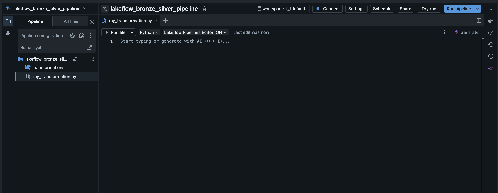
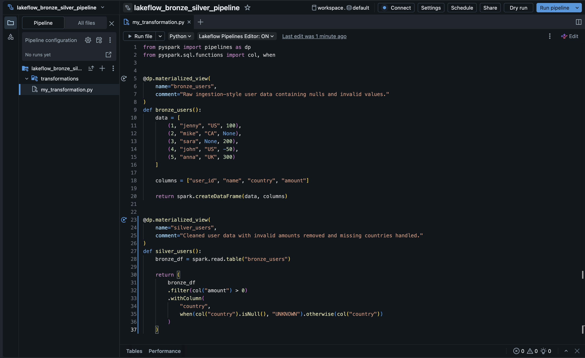
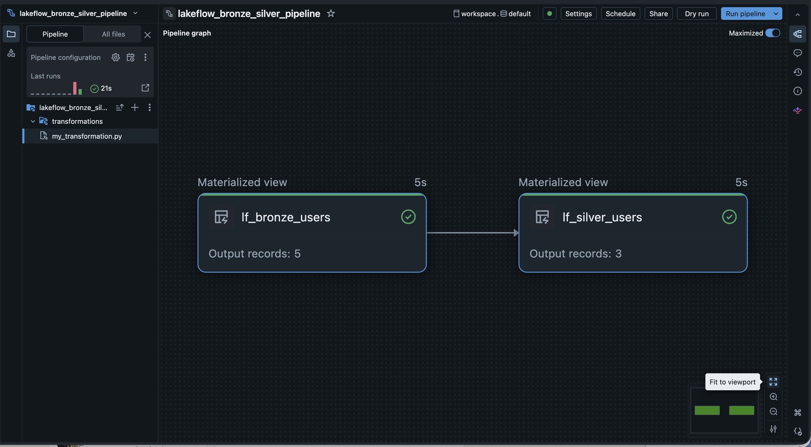
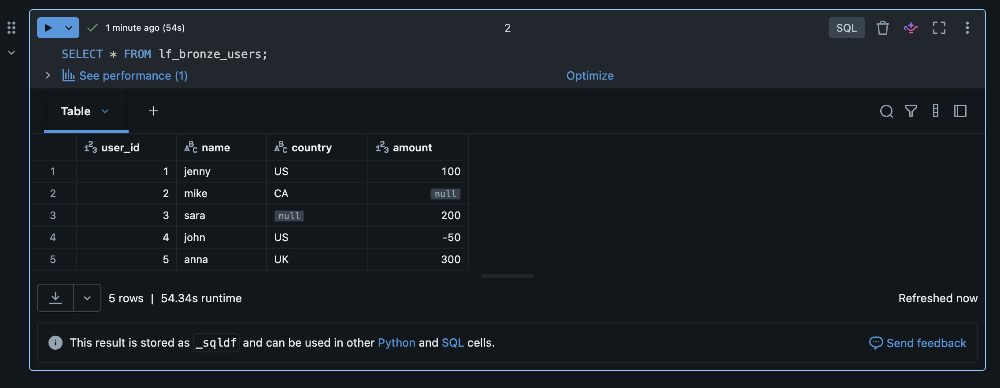
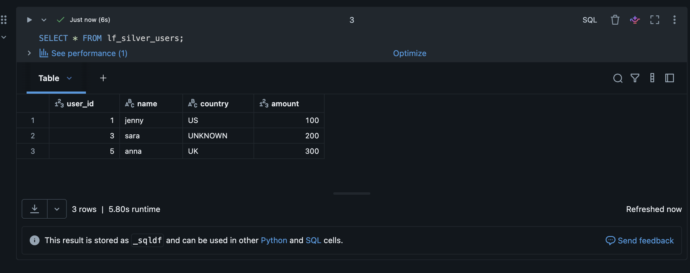

# Databricks Lakeflow Bronze to Silver Pipeline

## Overview

This project demonstrates a Bronze-to-Silver data pipeline built with Databricks Lakeflow.

The purpose of this exercise was to compare a manually executed notebook-based transformation with a declarative pipeline approach. In the previous Bronze-to-Silver project, the transformation logic was written and executed manually in a notebook. In this project, the same general data engineering pattern is implemented as a Lakeflow pipeline, where Databricks manages the dependency graph and execution flow.

---

## What This Project Demonstrates

This project shows how raw ingestion-style data can be transformed into a cleaned Silver layer using a declarative pipeline.

The pipeline includes:

- A Bronze materialized view containing raw data
- A Silver materialized view derived from Bronze
- Cleaning logic that removes invalid records
- Automatic dependency handling between pipeline steps

---

## Manual Pipeline vs Lakeflow Declarative Pipeline

### Manual Notebook Pipeline

In a manual notebook-based pipeline, the developer controls each step directly.

The process looks like:

Bronze table is created manually  
Transformation code is run manually  
Silver table is written manually  

This is useful for learning and exploration, but the developer is responsible for execution order and reruns.

---

### Lakeflow Declarative Pipeline

In a Lakeflow pipeline, the developer defines what each dataset should be, and Databricks manages how to run it.

The process looks like:

Define Bronze dataset  
Define Silver dataset based on Bronze  
Databricks builds the dependency graph  
Databricks executes the pipeline in the correct order  

This is closer to a production-style pipeline because the relationships between datasets are declared in code and managed by the platform.

---

## Architecture

Bronze → Silver

Raw ingestion data → Cleaned data

---

## Pipeline Logic

### Bronze Layer

The Bronze layer simulates raw ingestion data.

It includes example data quality issues such as:

- Null amount values
- Missing country values
- Negative amount values

---

### Silver Layer

The Silver layer applies cleaning rules:

- Keeps only records where amount is greater than zero
- Replaces missing country values with `UNKNOWN`
- Produces a cleaner dataset for downstream analytics

---

## Technologies Used

- Databricks
- Lakeflow
- Delta Lake
- PySpark
- Python

---

## Screenshots

### Pipeline Setup

---

### Pipeline Code

Note: The screenshot may show earlier table names such as `bronze_users` and `silver_users`. Because those names were already used in a previous manual pipeline project, the final Lakeflow version was updated to use `lf_bronze_users` and `lf_silver_users` to avoid table name conflicts in the target schema.

---

### Pipeline Graph

The pipeline graph shows the dependency between the Bronze and Silver layers. Databricks automatically recognizes that `lf_silver_users` depends on `lf_bronze_users` and runs the pipeline in the correct order.

---

### Bronze Raw Data

---

### Silver Cleaned Data

---

## Key Concepts Demonstrated

- Declarative pipeline development
- Bronze and Silver data layers
- Lakeflow materialized views
- Automatic dependency resolution
- Pipeline graph / lineage
- Data quality transformation
- Managed pipeline execution

---

## Key Takeaway

This project demonstrates how Databricks Lakeflow can be used to define data pipelines declaratively.

Instead of manually running each transformation step, the pipeline defines the relationship between Bronze and Silver datasets, and Databricks handles execution order, dependency tracking, and pipeline orchestration.

This pattern is useful for building more maintainable and production-style data pipelines.
